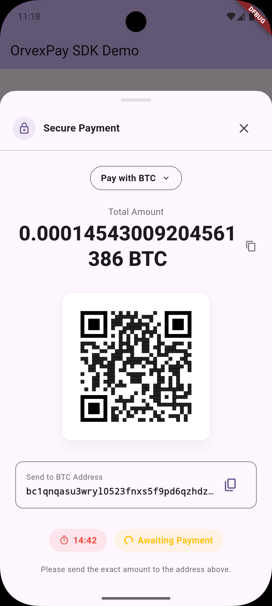

# OrvexPay Flutter SDK

[](https://pub.dev/packages/orvex_pay)
[](https://opensource.org/licenses/MIT)
[](https://flutter.dev)

A powerful, native Flutter SDK for integrating **OrvexPay** into your mobile applications. Provide a premium, high-performance crypto checkout experience with support for multiple cryptocurrencies, native UI, and automatic theme adaptation.



---

## 🚀 Features

- **✅ Native Payment UI**: No WebViews. A fully native, smooth, and secure payment modal.
- **🔄 Dynamic Currency Switching**: Users can switch between dozens of supported cryptocurrencies (BTC, ETH, USDT, SOL, etc.) directly within the modal.
- **🌓 Auto-Theming**: Automatically adapts to your app's Light or Dark mode.
- **⏱️ Real-time Polling**: Automatic payment status tracking with live updates.
- **📥 Typed Results**: Get precise payment outcomes (Success, Cancelled, Error) using `Future` returns.
- **📱 QR Code Generation**: Instant local QR code generation for easy mobile-to-mobile payments.
- **📋 Clipboard Integration**: One-tap copying for wallet addresses and amounts.

---

## Example App

A complete, working example app is included in the `example` directory. It demonstrates:
- How to initialize `OrvexClient` and handle errors.
- Implementing an invoice creation flow.
- Awaiting and handling the `OrvexPayStatus` from the modal.

To run it:
```bash
cd example
flutter run
```

---

## 📦 Installation

Add `orvex_pay` to your project by running:

```bash
flutter pub add orvex_pay
```

Alternatively, add it manually to your `pubspec.yaml`:

```yaml
dependencies:
  orvex_pay: ^0.0.1
```

### Git Installation (Main Branch)

If you need the latest changes from the repository:

```yaml
dependencies:
  orvex_pay:
    git:
      url: https://github.com/OrvexPay/OrvexPay-Flutter-SDK.git
      ref: main
```

---

## 🛠️ Quick Start

### 1. Initialize the Client

Initialize the `OrvexClient` with your API Key.

```dart
import 'package:orvex_pay/orvex_pay.dart';

final client = OrvexClient(
  apiKey: 'YOUR_API_KEY_HERE',
);
```

### 2. Create an Invoice & Show Modal

You can create an invoice and show the native payment modal directly using `OrvexPayModal.show()`.

```dart
Future<void> handlePayment(BuildContext context) async {
  // 1. Prepare Invoice Request
  final request = CreateInvoiceRequest(
    priceAmount: 100.0,
    priceCurrency: 'USD',
    payCurrency: 'USDT', // Initial selected currency
    orderId: 'INV-12345',
    orderDescription: 'Premium Subscription',
  );

  try {
    // 2. Create Invoice
    final response = await client.createInvoice(request);

    // 3. Show Native Modal and Wait for Result
    final result = await OrvexPayModal.show(
      context,
      invoiceId: response.id,
      client: client,
    );

    // 4. Handle results based on OrvexPayStatus
    if (result == OrvexPayStatus.success) {
      // Payment Completed Successfully!
      ScaffoldMessenger.of(context).showSnackBar(
        SnackBar(content: Text('Success!')),
      );
    } else if (result == OrvexPayStatus.cancelled) {
      // User closed the modal before paying
      print("Payment Cancelled");
    }
  } catch (e) {
    print("Error: $e");
  }
}
```

---

## 🎨 Advanced Usage

### 🌑 Theming

The SDK is built to be "Zero Configuration". It uses your app's `Theme.of(context)` to automatically match your design system:

- **Colors**: Uses `scaffoldBackgroundColor`, `primaryColor`, `cardColor`, and `textTheme`.
- **Modes**: Switches automatically between Dark and Light mode based on your `MaterialApp` settings.

### 📊 Payment Statuses

The `show` method returns a `OrvexPayStatus` enum:

| Status | Description |
|---|---|
| `OrvexPayStatus.success` | Payment was detected and confirmed by the network. |
| `OrvexPayStatus.cancelled` | User manually closed the payment sheet. |
| `OrvexPayStatus.error` | A critical error occurred (e.g., invoice expired). |

---

## 📄 License

This SDK is released under the [MIT License](LICENSE).
